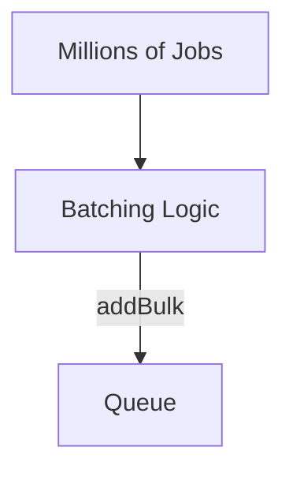
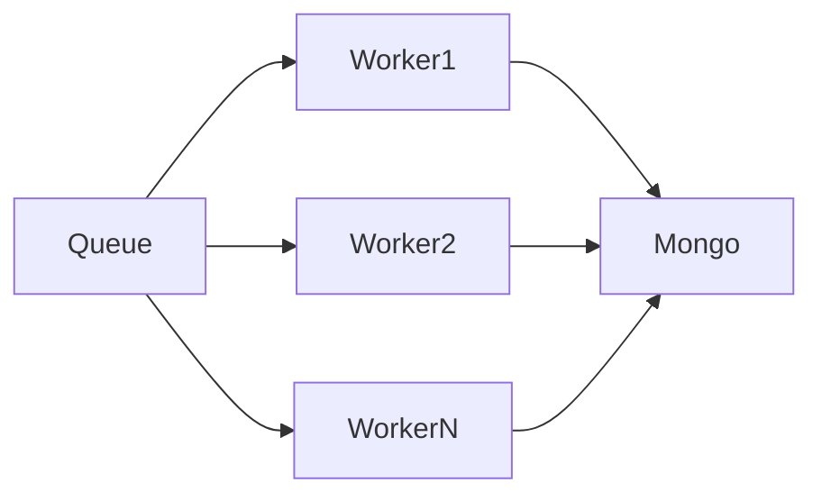
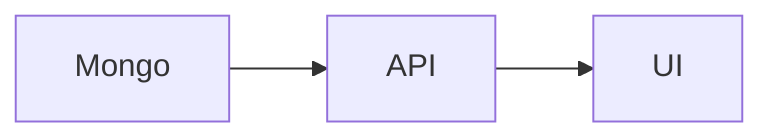

# 🏗️ System Architecture – Scalable Job Importer

## 📌 Overview

This document explains the **system design, architecture decisions, and scalability considerations** behind the **Scalable Job Importer with Queue Processing & Import History Tracking**.

The system is built to reliably ingest **large-scale job feeds (up to millions of records)**, process them asynchronously, and provide full visibility into each import run.

---

## 🎯 High-Level Goals

- Handle **high-volume job feeds** efficiently
- Avoid database duplication using **upsert logic**
- Ensure **fault tolerance & retryability**
- Keep Redis memory usage under control
- Maintain **clear import history & observability**
- Be **future-ready** for microservices & horizontal scaling

---

## 🧱 High-Level Architecture

```mermaid
flowchart LR
    Cron[Cron Scheduler] --> ImportService[Job Import Service]
    ImportService --> XML[External XML Feeds]
    ImportService --> Parser[XML → JSON Parser]
    Parser --> Transformer[Data Transformer]
    Transformer --> Queue[BullMQ Queue (Redis)]

    Queue --> Worker[Worker Pool]
    Worker --> Mongo[(MongoDB)]
    Worker --> Logs[Import Logs]

    Mongo --> UI[Next.js Admin UI]
    Logs --> UI
```

---

## 🔁 Core Flow Explained

### 1️⃣ Cron Scheduler

- Runs automatically every **hour** (configurable)
- Prevents overlapping executions using a runtime lock

```js
JOB_IMPORT_CRON_TIME = "0 * * * *";
```

---

### 2️⃣ Job Import Service

Responsibilities:

- Fetch XML feed from external APIs
- Parse XML → JSON
- Normalize & transform data
- Create an **import log entry**
- Push jobs into the queue in **batches**

---

### 3️⃣ Import Log (Observability Layer)

Each import run creates a record in `import_logs`:

```js
{
  total_fetched,
  total_imported,
  total_failed,
  new_jobs,
  updated_jobs,
  started_at,
  finished_at,
  failed_jobs[]
}
```

📌 **Why this matters**

- Full auditability
- Debugging failed imports
- UI-driven monitoring

---

## 🚦 Queue Design (BullMQ + Redis)

### Queue Configuration

```js
new Queue("job-importer", {
  defaultJobOptions: {
    removeOnComplete: 100,
    removeOnFail: 1000,
  },
});
```

### Design Decisions

| Setting                | Reason                             |
| ---------------------- | ---------------------------------- |
| removeOnComplete = 100 | Prevent Redis memory bloat         |
| removeOnFail = 1000    | Keep recent failures for debugging |
| addBulk()              | Optimized batch insertion          |
| Redis                  | Fast, persistent queue backend     |

📌 **Why BullMQ?**

- High throughput
- Worker concurrency support

---

## 📦 Batch Queueing Strategy



### Why Batch Processing?

- Prevents memory spikes
- Reduces Redis round-trips
- Faster ingestion for large feeds
- Enables controlled backpressure

```js
JOB_BATCH_SIZE = 10000;
```

---

## ⚙️ Worker Architecture



### Worker Configuration

```js
concurrency = WORKER_CONCURRENCY || 10;
```

### Responsibilities

- Consume jobs from queue
- Validate job data
- Perform MongoDB upsert
- Emit success/failure events
- Update import logs

📌 **Concurrency Benefits**

- Parallel execution
- Faster processing
- Configurable via environment

---

## 🧠 MongoDB Data Strategy

### Job Collection

- Unique index on external job ID
- Uses **upsert** to:
  - Insert new jobs
  - Update existing ones

---

## ❌ Failure Handling Strategy

### Possible Failures

- Invalid XML data
- Transformation errors
- MongoDB validation errors
- Redis connectivity issues

### Handling

- Failed jobs captured with reason
- Stored in `import_logs.failed_jobs`
- Queue retains last 100 failed jobs
- Worker does not crash on single job failure

---

## 📡 Worker Event Tracking

```js
worker.on("completed", updateLogOnSuccess);
worker.on("failed", updateLogOnError);
worker.on("error", logCriticalError);
```

📌 **Why Events?**

- Decouples business logic
- Accurate statistics
- Clean separation of concerns

---

## 📊 Admin UI (Next.js)

Features:

- Import history listing
- Pagination & sorting
- Filter by date/status
- Real-time refresh ready



---

## 🚀 Scalability Considerations

| Aspect           | Strategy           |
| ---------------- | ------------------ |
| Millions of jobs | Batch queueing     |
| High throughput  | Worker concurrency |
| Fault tolerance  | Queue retries      |
| Memory control   | removeOnComplete   |
| scaling          | Concurrancy        |

---

## 🧩 Why This Architecture Works

- **Decoupled**: Import ≠ Processing
- **Scalable**: Workers can scale
- **Observable**: Full import history
- **Resilient**: Failures don’t break pipeline
- **Production-ready**: Used patterns from real-world systems

---

## 🏁 Conclusion

This system is designed not just to work, but to **scale confidently**, handle failures gracefully, and remain maintainable as requirements grow.
